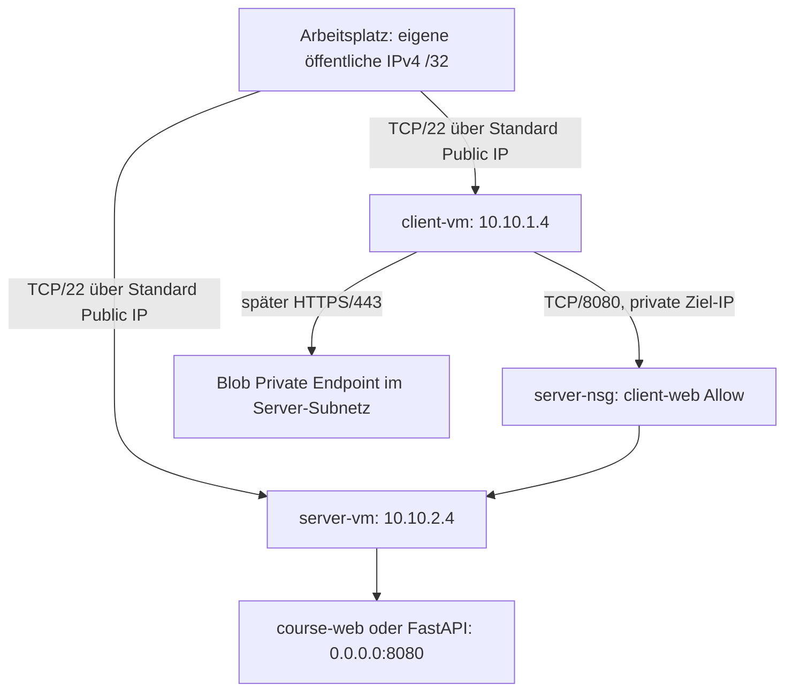

# Gemeinsame Architektur

Die RG heißt `rg-azlinux-course-<labId>` und trägt `courseLabId=<labId>`. Namen sind innerhalb der RG konstant; die RG isoliert den Kurs. Standardregion ist Sweden Central, ohne Zusage verfügbarer VM-Kapazität. IP-Adressen sind konfigurierbar. Vorher lokale und VPN-Netze erfassen; `existingNetworks` wird auf Überlappung geprüft. Nicht erfasste Netze kann das Skript nicht erkennen.

Beispieladressierung, nicht gemessene Ausgabe: VNet `10.10.0.0/16`, Client `10.10.1.0/24`, Server `10.10.2.0/24`. Azure reserviert erste vier und letzte Adresse jedes Subnetzes. Deshalb `.4` als erste nutzbare VM-Adresse. Private Endpoint bekommt eine dynamische, separat abgefragte Adresse. Die NIC ist die Azure-Netzwerkschnittstelle, die Linux-Gastadresse wird über Azure/DHCP bereitgestellt; nicht manuell per `ip addr add` überschreiben.

## Zugang und Outbound

Jede NIC bekommt eine Standard IPv4 Public IP. SSH-Inbound nur von `adminSourceCidr`, genau einer eigenen öffentlichen IPv4 `/32`. Beide VMs werden direkt administriert. Kein SSH-Agent-Forwarding, keine Kopie des privaten Schlüssels auf VMs. Der HTTP-Port ist nur von `clientIp/32` zu `serverIp/32` erlaubt. NSG-Regel 4096 verweigert alle weiteren neuen Inbound-Verbindungen einschließlich des sonst standardmäßig erlaubten VNet-Verkehrs. NSGs sind zustandsbehaftet; Rückverkehr einer erlaubten Verbindung benötigt keine zusätzliche Inbound-Regel.

Subnetze setzen `defaultOutboundAccess:false` ausdrücklich. Der zugeordnete Standard Public IP ist der explizite Egress-Pfad; Outbound-NSG-Standardregeln erlauben Paketinstallation über Internet. Das ist eine bewusst einfache Lab-Abwägung: zwei IPs kosten laufend, sparen hier aber NAT Gateway und Bastion. Für Produktion sind private Administration und kontrolliertes Egress gesondert zu entwerfen. Entfernst du Public IPs, ist Paketinstallation ohne Ersatz-Outbound nicht zugesichert. Eine Route alleine erzeugt keinen NAT-Dienst.

## Erweiterungen

07: Blob Storage Standard LRS mit deaktiviertem Public Network Access, Blob Private Endpoint und Zone `privatelink.blob.core.windows.net`, Link ins VNet. Server-Subnetz hat PE-Netzwerkpolicies deaktiviert: dessen NSG schützt VM-NICs, ist in dieser Variante aber keine Filterinstanz für die PE-NIC. Storage-RBAC bleibt erforderlich.

08: beide VMs haben System-assigned Managed Identity. Ein Key Vault wird getrennt hinzugefügt; öffentliche Data Plane nur aus Administrator-IP, außerdem optional aus der expliziten Server-Public-IP. RBAC wird bewusst nicht automatisch vergeben.

09: ACA ist eine eigenständige Consumption-Umgebung in derselben RG, ohne Verbindung zum Lab-VNet. HTTPS-Ingress nur aus Administrator-IP; Zielport intern 8080. Dieses Teil-Lab demonstriert Laufzeit/Ingress, keinen Zugriff auf den Blob PE. Dafür wäre eine andere ACA-Netzwerkarchitektur nötig.

## Isolierte Fehler und Wiederherstellung

NSG-Fehler blockiert nur Client → Server/8080. UDR-Fehler ist `serverIp/32 → None` nur am Client-Subnetz. SSH vom Arbeitsplatz zur Public IP beider VMs bleibt von diesen Regeln unberührt. Auf Server-VM erfolgen nur Änderungen an `course-web`, nicht an SSH. TLS läuft separat auf Server-Loopback/8443. Container bindet lokal per Port-Mapping, ohne NSG-Erweiterung.
