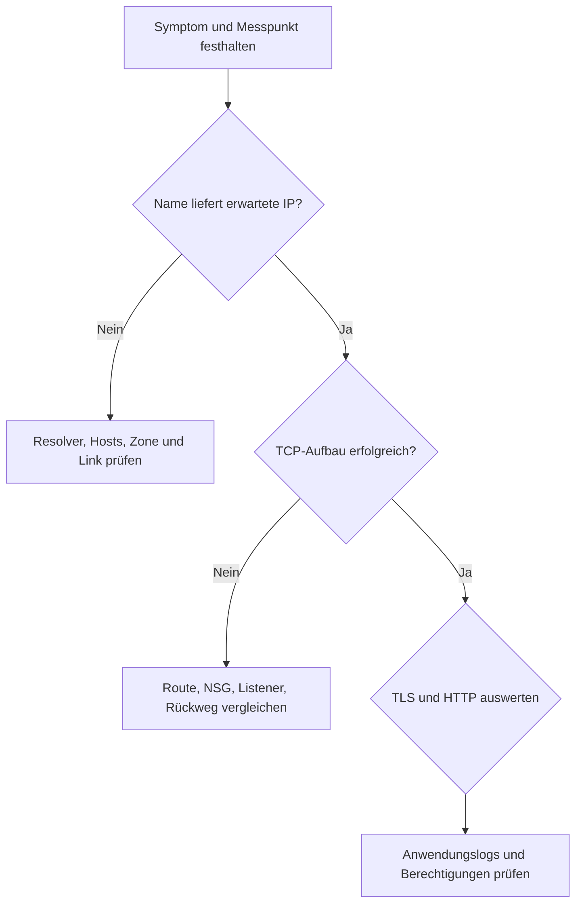

# Systematisch diagnostizieren

Ein Fehlerbericht braucht Messpunkt, UTC-Zeit, Zielname, tatsächlich verwendete IP, Port, Protokoll, erwartetes Ergebnis, konkretes beobachtetes Ergebnis. Formuliere vor jeder Messung eine prüfbare Hypothese. Notiere auch, was der Test nicht ausschließt.

| Ebene | Frage | Test | Begrenzung |
|---|---|---|---|
| DNS | Welches Ziel liefert der Resolver? | `dig`, zusätzlich `getent hosts` | Anwendung kann Hosts-Datei, Cache oder eigenen Resolver benutzen |
| Route | Welcher Weg wird ausgewählt? | `ip route get`, Azure effective routes | Linux sieht nicht alle Azure-Fabric-Entscheidungen |
| Regeln | Darf ein neuer Flow passieren? | effektive NSG, IP flow verify | keine Aussage über Listener, TLS oder App |
| TCP | Erfolgt der Verbindungsaufbau? | `nc -vz`, kleiner Nmap-Scan | offen bedeutet keine korrekte Anwendung |
| TLS | Ist Identität/Vertrauen gültig? | `openssl s_client`, curl mit CA | Zertifikatsfehler ist nicht automatisch TCP-Fehler |
| HTTP | Welcher Status kommt an? | `curl -i` | 401/403 beweist nicht allein, welche Komponente antwortet |
| Anwendung | Was verarbeitet der Dienst? | Journal/Containerlogs, Request-ID | fehlender Logeintrag kann falsche Replica oder Logkonfiguration bedeuten |

Beispiel, keine echte Messung: Client-curl läuft in Timeout; Server-Loopback-curl liefert 200. Das bestätigt einen lokalen Dienst, schließt aber falsches Binding nicht aus. Erst `ss` auf dem Server und Client-/Server-Capture unterscheiden, ob SYN am Ziel ankommt. Kein SYN in einer korrekt gefilterten Capture am Ziel macht Upstream-Block plausibel; es kann ebenso ein falscher Capture-Filter, falsches Interface oder falsches Ziel sein.

Ändere einen Faktor pro Experiment. Nach Fix zuerst identischen Test vom identischen Messpunkt wiederholen, dann Negativtest (unerlaubter Port bleibt nicht zugänglich). Bestehende NSG-Flows können trotz Regeländerung bestehen; neue curl-Prozesse ohne Keep-alive verwenden. Ein leerer Capture oder ausbleibender Ping reicht niemals allein als Beweis für eine NSG-Ursache.

Incident-Notiz: Hypothese → Test → tatsächliche Beobachtung → Interpretation mit Alternativen → nächste Messung → kleinste Korrektur → Erfolgstest → Cleanup. Übungen geben synthetische Symptome; erfundene Beispielausgaben dürfen nicht als eigene Beweise abgegeben werden.
